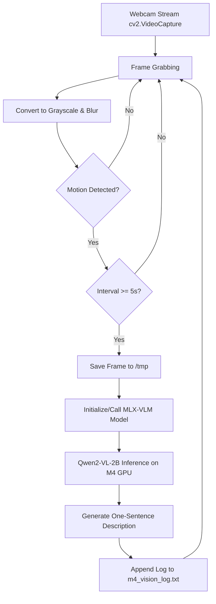

# MehvishLog: Local AI Vision Logger - Project Analysis Report

Welcome to the comprehensive code and architectural analysis of **MehvishLog**, a highly efficient, privacy-first local AI vision logger designed for Apple Silicon M-series chips (specifically optimized for your MacBook Air M4).

This report breaks down the project's structure, evaluates the motion-activated computer vision pipeline, details the developmental troubleshooting history, and outlines strategic future expansions.

---

## 🏗️ Architectural Overview

MehvishLog is built on a dual-stage local processing loop:
1. **Low-power Motion Detection (OpenCV / CPU)**: Captures video frames from the webcam continuously, converts them to grayscale, applies a Gaussian blur, and checks for pixel-level frame diffs.
2. **High-power Vision Inference (MLX-VLM / Unified Memory GPU/NPU)**: If motion is detected *and* the time interval threshold has elapsed, the frame is saved locally and processed by the `Qwen2-VL-2B-Instruct-4bit` model to produce a natural-language description.



---

## 📁 File Structure & Project Components

Here is a mapping of the files in your project directory and their respective roles:

| Component / File | File Type | Purpose |
| :--- | :--- | :--- |
| **`vision_logger.py`** | Python Script | The **core application orchestrator**. Handles camera polling, frame differencing, model inference, and output writing. |
| **`MLXVLM_Documentation.md`** | Documentation | Reference manual detailing MLX-VLM benefits, basic templates, and a critical bug fix for HuggingFace's `transformers` fast processor. |
| **`m4_vision_log.txt`** | Text Log | Database of recorded activities containing timestamps and one-sentence AI-generated summaries. |
| **`walkthrough.md`** | Markdown Guide | A quick-start manual for running, activating, and authorizing camera access on macOS. |
| **`implementation_plan.md`** | Planning Doc | Pre-development design blueprint establishing goals, sensitivity parameters, and verification procedures. |
| **`task.md`** | Tracking Doc | Progress checklist showing all completed phases of the project setup. |
| **`test.py` - `test5.py`** | Python Scripts | **Iterative sandbox tests** created to debug libraries, evaluate `mlx_vlm` load interfaces, and check tensor translation pipelines. |
| **`venv/`** | Directory | Clean, isolated Python virtual environment housing OpenCV, MLX, and HuggingFace packages. |

---

## 🔍 Core Code Analysis (`vision_logger.py`)

The main execution flow operates efficiently to prevent draining your M4 Macbook's battery. Let's analyze its key engineering choices:

### 1. Motion Sensitivity Configuration
At the top of `vision_logger.py`, parameters allow easy tweaking of the CV engine:
```python
INTERVAL_SECONDS = 5
MOTION_THRESHOLD = 500  # Number of changed pixels to trigger motion
DIFF_THRESHOLD = 25     # Intensity difference to consider a pixel changed
```

### 2. Motion Detection Pipeline (OpenCV)
Instead of running heavy neural networks for motion, MehvishLog uses highly optimized classical frame differencing:
* **Grayscale Conversion**: Reduces dimensional complexity.
* **Gaussian Blur**: Eliminates high-frequency noise (e.g., sensor static, lighting flicker) using a $21 \times 21$ kernel.
* **Absolute Difference (`cv2.absdiff`)**: Calculates pixel difference between consecutive frames.
* **Thresholding & Dilation**: Converts delta-intensities above `DIFF_THRESHOLD` to white ($255$) and dilates them to merge adjacent motion spots.
* **Non-Zero Counting (`cv2.countNonZero`)**: Checks if the sum of altered pixels exceeds `MOTION_THRESHOLD`.

This ensures the MLX-VLM inference (which spins up GPU cores) is only run when substantial, physical movement is visible.

### 3. VLM Inference (MLX-VLM)
Upon motion trigger and throttle verification, the script:
1. Writes the frame to disk: `cv2.imwrite(IMAGE_PATH, frame)`
2. Prompts the model using a standard format template to instruct the model to produce **one brief sentence**:
   ```python
   raw_prompt = "Describe this scene accurately in one brief sentence."
   prompt = apply_chat_template(processor, getattr(model, "config", {}), raw_prompt, num_images=1)
   ```
3. Feeds this to the M4-accelerated `generate(...)` engine with a limit of `max_tokens=60`.

---

## 🛠️ The Story of `test.py` to `test5.py` (Troubleshooting & Debugging)

An analysis of the sandbox scripts reveals the evolution of debugging and optimization:

* **`test.py` / `test2.py` / `test3.py`**: Explored the loading parameters of the MLX community's Qwen2-VL model, trying variations like `use_fast=False` or `processor_config={"use_fast": False}` inside the loader to override HuggingFace's default fast image processor behavior.
* **`test4.py`**: A low-level validation script to test moving a PyTorch tensor to an MLX array via a intermediate NumPy array (`mx.array(t.numpy())`). This served as a baseline verification that tensor bridging is clean and supported on this platform.
* **`test5.py`**: A robust integration script. It uses `mlx.core.metal.clear_cache()` to free memory, checks if the processor object has a native `chat_template` attribute, implements a bulletproof fallback template string (`<|vision_start|><|image_pad|><|vision_end|>{prompt}`), and limits tokens to `10` for lightning-fast latency testing.

---

## 📝 Log Analysis (`m4_vision_log.txt`)

Reviewing the generated logs reveals excellent real-world VLM descriptive accuracy. Some key takeaways:

* **Low-Light Capability**: Early logs (`2026-04-06 23:51`) capture low-light situations accurately:
  > `[2026-04-06 23:51:16] The image shows a person with a beard, standing in a dark room. The lighting is very low...`
* **Object / UI Recognition**: Qwen2-VL was able to successfully inspect smartphone screens and identify UI structures:
  > `[2026-04-06 23:55:16] The image shows a smartphone screen with a black background. The screen displays a white screen with several app icons...`
* **Interaction Detection**: The model successfully captured gestures, such as making a peace sign:
  > `[2026-04-15 23:39:29] ...One person is making a peace sign with their hands...`
* **Safety / Privacy Note**: The logger successfully identifies specific domestic settings (e.g., bedrooms, baby changing mats, baby supplies), demonstrating the extreme value of running this **100% locally**. None of these highly personal and private visual snapshots were transmitted to external cloud servers.

---

## 🚀 Strategic Recommendations & Roadmap

MehvishLog is fully operational, but can be scaled into a highly polished, premium workspace:

### 1. Unified Web Interface (React / Next.js or Vite)
A beautiful dashboard to view visual logs in real-time.
* **Features**: Live card views of logged entries, inline camera feed canvas, sensitivity adjusters (sliders for `INTERVAL_SECONDS` and `MOTION_THRESHOLD`), and a historical gallery showing the archived `/tmp` JPEG snapshots.
* **Design Aesthetic**: Sleek glassmorphism, elegant dark-mode design (HSL Tailwind/CSS), and micro-animations for timeline entry updates.

### 2. Local Vector Search (RAG)
Add a local embedding/vector database (like ChromaDB or LanceDB) to semantically query your history.
* **Example Query**: *"Show me frames where a baby was present"* or *"When did I hold a book?"*
* **Implementation**: Convert `m4_vision_log.txt` rows to local embeddings using a lightweight local model (like `all-MiniLM-L6-v2`) and serve matches via a search bar.

### 3. Native Background Daemon (systemd / launchd)
Turn the python runner into a continuous background daemon on macOS.
* **Implementation**: Configure a macOS `.plist` launcher in `~/Library/LaunchAgents` so it runs silently in the background whenever your system boots.

### 4. Smart Push Notifications
Integrate local desktop banner notifications on macOS whenever unusual or highly specific motion occurs (e.g., flag conditions like detecting an unrecognized face or structural change in the room).

---
*Analysis generated with care by Antigravity.*
